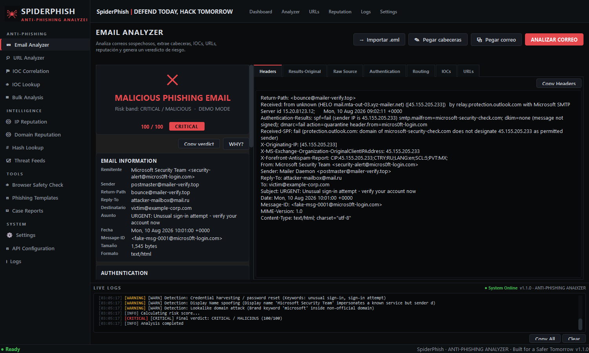
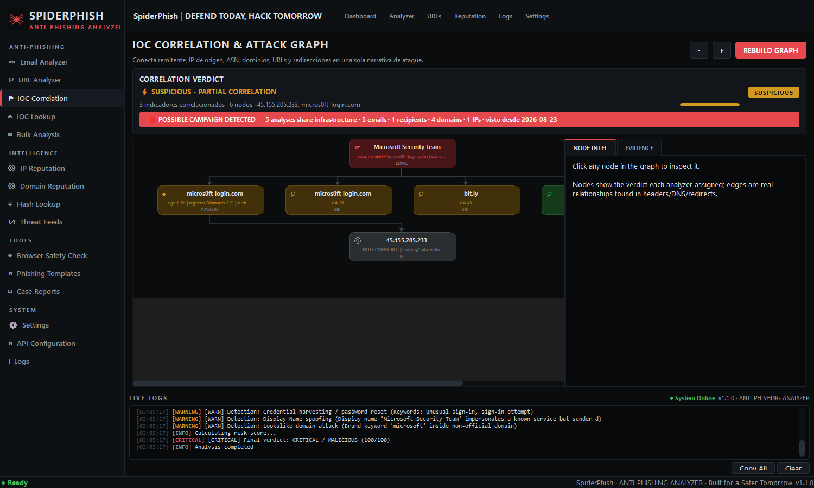
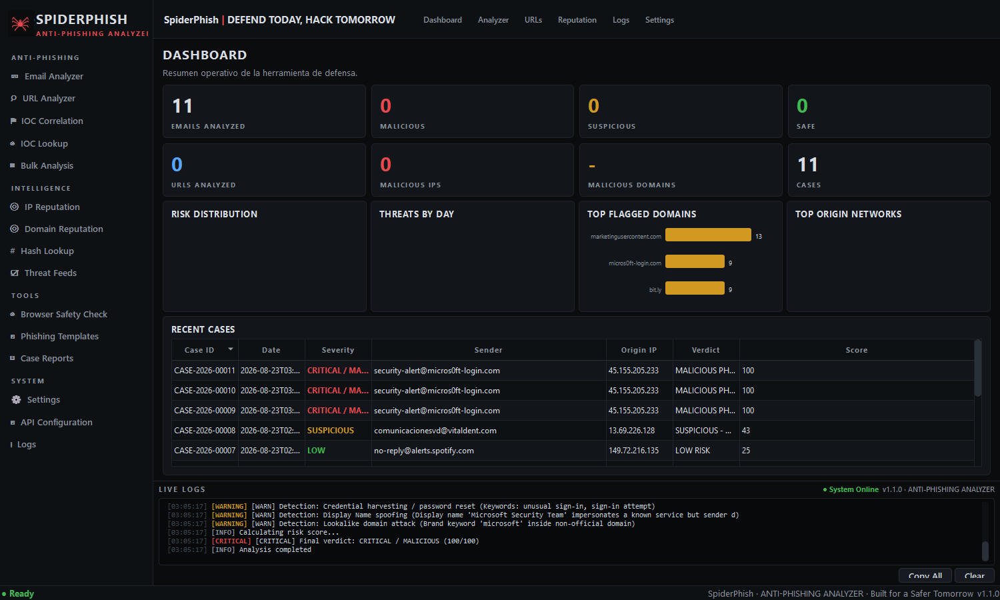
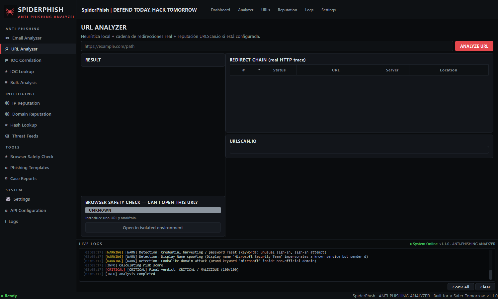

# 🕷️ SpiderPhish — ANTI-PHISHING ANALYZER


**DEFEND TODAY, HACK TOMORROW**

Herramienta de escritorio profesional para análisis anti-phishing, pensada para
analistas SOC/DFIR. Importa correos sospechosos (`.eml`, texto o cabeceras),
extrae cabeceras e IOCs, analiza SPF/DKIM/DMARC, detecta la IP de origen,
consulta reputación (AbuseIPDB, URLScan, VirusTotal, OTX, GreyNoise), sigue
cadenas de redirección reales, **correlaciona todos los indicadores en un
grafo de ataque**, detecta campañas repetidas y produce informes PDF estilo
SOC/DFIR.

```
EMAIL → Parsing → Headers → Authentication → Origin IP → Reputation
      → IOCs → URLs → Redirects → URLScan → Risk Score → Verdict
      → IOC CORRELATION → ATTACK GRAPH → CAMPAIGN DETECTION
      → Recommendations → Case → PDF Report → Live Logs
```

## Capturas

| Email Analyzer | IOC Correlation & Attack Graph |
|---|---|
|  |  |

| Dashboard | URL Analyzer |
|---|---|
|  |  |

---

## Características

| Área | Detalle |
|---|---|
| Email Analyzer | Parsing real RFC822 (`email.parser`), 20+ cabeceras clave, pestañas Headers / Results-Original / Raw Source / Authentication / Routing / IOCs |
| Origin IP Engine | `X-Originating-IP`, `X-MS-...-OriginalClientIPAddress`, cadena `Received:` completa, clasificación Residential/ISP/Hosting/Tor |
| Authentication | Parser SPF/DKIM/DMARC sobre `Authentication-Results` y `Received-SPF`, indicadores MATCH/CRITICAL |
| Identity checks | From vs Return-Path/Sender/Reply-To, display-name spoofing, homoglyphs Unicode |
| IOC extraction | IPv4/IPv6, dominios, URLs (incl. `hxxp://`), MD5/SHA1/SHA256/SHA512, emails, filenames peligrosos |
| URL analysis | Heurística local (shorteners, punycode, TLDs sospechosos, typosquatting, credential paths, open-redirects) + redirect chain HTTP real + URLScan.io |
| **IOC Correlation** | Conecta remitente, dominio, IP, ASN, URLs y redirects en una sola narrativa; 8 reglas ponderadas (auth fail, reputación, enlace DNS↔IP, dominios nuevos <30d, credential harvesting, multi-hop, brand spoofing...) y veredicto tipo *HIGH CONFIDENCE PHISHING* |
| **Attack Graph** | Grafo visual clicable `Email → Dominio → IP → ASN → URL → Redirects → Destino final`; cada nodo abre su inteligencia completa (reputación, DNS/RDAP, cadena Received, flags) |
| **Campaign Detection** | Persistencia local de IOCs observados; si varios análisis comparten infraestructura → banner *POSSIBLE CAMPAIGN DETECTED* (nº emails, receptores, dominios, IPs, primera vez visto) |
| Risk Engine | Scoring ponderado 0-100 normalizado, bandas SAFE→CRITICAL/MALICIOUS, panel **WHY?** con cada factor |
| Browser Safety | SAFE TO OPEN / NOT RECOMMENDED / DO NOT OPEN — nunca abre URLs automáticamente |
| Bulk Analysis | Cientos de `.eml` en paralelo, export CSV/JSON |
| Cases | `CASE-YYYY-NNNNN` persistidos en SQLite con notas/tags, export PDF |
| Live Logs | Consola inferior en tiempo real + histórico persistente |
| Security | API keys cifradas (Fernet), SSRF guard, TLS verification, timeouts/retries |

---

## Instalación

Requisitos: **Windows 10/11**, **Python 3.10+**.

```bat
git clone <repo> spiderphish
cd spiderphish
python -m venv .venv
.venv\Scripts\activate
pip install -r requirements.txt
python main.py
```

### Versión de un solo archivo (empresas que solo ejecutan `.py`)

Genera un único Python autocontenido con toda la aplicación dentro:

```bat
python scripts\build_singlefile.py
python SpiderPhish.py
```

Solo necesita las dependencias instaladas (`pip install -r requirements.txt`);
`config/`, `data/`, `reports/` y `cases/` se crean junto al archivo.

## Demo Mode

La aplicación arranca en **Demo Mode** (sin claves): todo el análisis local
funciona; los proveedores externos muestran `NOT CONFIGURED` y explican qué se
necesita. **Nunca se inventan resultados externos.**

## Configuración

### API keys

Dos opciones (ambas equivalentes):

1. **GUI**: `SYSTEM → API Configuration`. Las claves se guardan **cifradas con
   Fernet** en `config/secure.json`; la clave maestra vive en
   `config/.spiderphish.key`.
2. **`.env`**: copia `.env.example` a `.env` y rellena las variables.
   Se importan al almacén cifrado en el primer arranque.

Proveedores soportados:

| Proveedor | Uso | Clave gratuita |
|---|---|---|
| AbuseIPDB | Reputación IP origen | https://www.abuseipdb.com/account/api |
| URLScan.io | Submit/search de URLs, verdicts, screenshot | https://urlscan.io/user/profile |
| VirusTotal | IP/dominio/hash lookups | https://www.virustotal.com/gui/my-apikey |
| AlienVault OTX | Pulses por IP/dominio | https://otx.alienvault.com |
| GreyNoise | Contexto scanning/noise | https://viz.greynoise.io/signup |
| MHA | Análisis remoto opcional de cabeceras (OFF por defecto; envía datos fuera) | Settings → API Configuration |

> ⚠️ Aviso de privacidad integrado: cualquier envío a servicios externos es
> explícito. El análisis local nunca sube el correo a ningún servicio.

### Settings generales

`SYSTEM → Settings`: timeout, retries, max redirects, concurrencia, proxy,
verificación TLS, SSRF guard, demo mode, nivel de log, rutas de BD/informes.

---

## Construir el ejecutable Windows

```bat
build_windows.bat
```

Genera `dist\SpiderPhish.exe` (PyInstaller onefile, icono de araña incluido).
El script crea el entorno, instala dependencias, genera el icono
(`scripts\generate_icon.py`) y compila con `spiderphish.spec`.

---

## Arquitectura

```text
app/
├── main.py                  # entry point GUI
├── config/
│   └── settings.py          # AppSettings (.env + config/app.json)
│                            # SecureStore (Fernet, claves cifradas)
├── core/
│   ├── database.py          # SQLite + migraciones versionadas + ioc_observations
│   └── logging_setup.py     # logging estructurado + LogBus Qt
├── analyzers/
│   ├── email_analyzer.py    # orquestador del pipeline (asyncio)
│   ├── authentication_analyzer.py
│   ├── ip_analyzer.py       # PTR/RDAP + clasificación infra
│   ├── domain_analyzer.py   # DNS (A/MX/NS/TXT/CAA...) + RDAP age
│   ├── url_analyzer.py      # heurística + redirects
│   ├── redirect_analyzer.py # wrapper WhereGoes adapter
│   ├── advanced_detection.py# BEC/quishing/homoglyphs/brand spoofing
│   ├── risk_engine.py       # scoring ponderado + WHY
│   ├── recommendations.py   # recomendaciones dinámicas
│   ├── correlation.py       # motor IOC Correlation + Attack Graph
│   └── campaigns.py         # detección de campañas (ioc_observations)
├── integrations/
│   ├── base.py              # ThreatIntelProvider / IP-URL-Domain providers
│   ├── registry.py          # registro de proveedores
│   ├── abuseipdb.py         # API v2 real
│   ├── urlscan.py           # submit/result/search real
│   ├── virustotal.py        # v3 ip/domain/hash
│   ├── otx.py               # pulses
│   ├── greynoise.py         # community API
│   ├── mha_adapter.py       # MHA opcional (fallback local siempre)
│   └── wheregoes_adapter.py # redirect trace local httpx (SSRF-safe)
├── models/schemas.py        # modelos Pydantic compartidos
├── reports/pdf_report.py    # informe PDF SOC/DFIR (ReportLab)
├── utils/
│   ├── email_parsing.py     # headers/Received/auth parsing
│   ├── ioc_extraction.py    # regex IOCs
│   ├── url_heuristics.py    # flags/scoring de URLs
│   └── net.py               # SafeClient + SSRF guard
├── gui/
│   ├── main_window.py       # sidebar + topbar + pages + consola
│   ├── theme.py             # tema dark QSS (SOC aesthetic)
│   ├── icons.py             # logo araña programático
│   ├── context.py           # contenedor de dependencias
│   ├── workers.py           # QThread workers (UI nunca se congela)
│   ├── widgets/             # badges, cards, tablas, log console
│   └── pages/               # 16 páginas completas
tests/                       # pytest unit + integración (+ fixtures .eml)
scripts/                     # build_singlefile, generate_icon, smoke_gui,
                             # make_screenshots
assets/                      # iconos .ico/.png + version info
```

### Modelo de seguridad

- **API keys**: solo en memoria/cifrado; jamás en código fuente ni logs
  (enmascaradas en UI).
- **SSRF guard**: bloquea IPs privadas/reservadas/link-local (incluido
  `169.254.169.254`), resuelve DNS antes de conectar, esquemas limitados a
  http/https, límite de redirects. Override solo para laboratorio.
- **Sin ejecución de contenido**: los adjuntos no se abren/ejecutan; el HTML
  del correo nunca renderiza scripts; las URLs maliciosas nunca se abren en el
  navegador del sistema.
- **Fail-open controlado**: si una API falla, el análisis continúa y el estado
  queda como `ERROR` / `NOT CONFIGURED` / `UNKNOWN` — **nunca "SAFE"**.

---

## Testing

```bat
python -m pytest tests\ -v
```

Cobertura: parser de cabeceras, Received chain, origin IP, SPF/DKIM/DMARC,
extracción de IOCs/URLs, heurísticas de URL, brand impersonation/homoglyphs,
redirect parser (MockTransport), risk engine, motor de correlación, campañas,
base de datos y pipeline E2E con emails fixture (`tests/data/*.eml`). Los
tests básicos **no dependen de servicios externos**.

Smoke test GUI (offscreen, genera PDF de ejemplo):

```bat
python scripts\smoke_gui.py
```

---

## Troubleshooting

| Problema | Solución |
|---|---|
| "AbuseIPDB: NOT CONFIGURED" | Configura la clave en Settings → API Configuration |
| Redirect/DNS errors en análisis | Normal sin conexión; quedan registrados como ERROR, no afectan al resto |
| `.msg` binario no importa | Exporta desde Outlook como `.eml` o pega las cabeceras |
| La ventana no recuerda posición | Borra `HKCU\Software\SpiderPhish` en Registro |
| Reset total de claves | Elimina `config\secure.json` y `config\.spiderphish.key` |

## Añadir nuevos proveedores Threat Intel

1. Crea `app/integrations/mi_proveedor.py` implementando
   `IPReputationProvider` / `URLReputationProvider` /
   `DomainReputationProvider` (ver `base.py`).
2. Implementa `is_configured()` leyendo la clave desde
   `self.store.get("MI_PROVEEDOR_API_KEY")`.
3. Regístralo en `app/integrations/registry.py`
   (`ProviderRegistry` + `configured_summary`).
4. Consume el resultado donde necesites (p. ej. `_ip_reputation`) — el core
   nunca cambia su comportamiento si el proveedor falla.

---

## Licencia

[MIT](LICENSE) — úsalo libremente, también en empresas.

## Disclaimer

SpiderPhish es una herramienta **defensiva** de análisis anti-phishing para
equipos SOC/DFIR. Úsala solo sobre correos y URLs que tengas legítimamente
autorizados a analizar. Los autores no se hacen responsables de usos indebidos.

---

*SpiderPhish v1.1.0 — Built for a Safer Tomorrow.*
